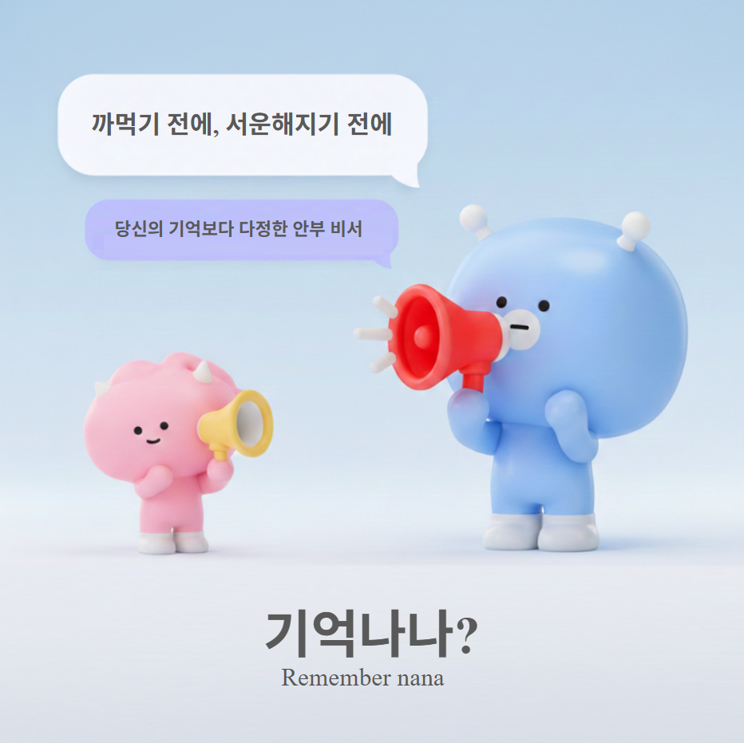

# 🌿 기억나나 (Remember NaNa)
> **"까먹기 전에, 서운해지기 전에. 다시 시작하는 안부의 한마디."**

  

---

## 📌 1. 프로젝트 개요 (Project Overview)
**기억나나**는 과거 대화 맥락(RAG 기술)과 외부 실시간 데이터(날씨, 뉴스, 시즌)를 결합하여, 사용자의 말투로 '연락할 명분'을 만들어주는 **초개인화 관계 케어 솔루션**입니다.

---

## ❓ 2. 문제 정의 (Pain Points)
우리는 관계를 소중히 여기지만, 바쁜 일상 속에서 다음과 같은 문제에 직면합니다.

* **연락의 심리적 부채**: "너무 오래 지났는데 지금 보내도 될까?"라는 머쓱함이 관계의 단절로 이어짐.
* **맥락의 부재**: 할 말이 없어 "식사하셨어요?"만 반복하는 영혼 없는 소통의 피로도.
* **관리의 한계**: 인맥이 넓어질수록 누가 소홀해졌는지 알 수 없는 '관계 사각지대' 발생.

---

## ✨ 3. 핵심 기능 (Core Features)

### ① [기억해 나나] RAG 기반 맞춤형 안부 생성
* **맥락 분석**: 업로드된 '카톡 대화 내보내기(txt)' 파일을 분석하여 상대와의 핵심 키워드(취향, 건강, 과거 약속) 추출.
* **말투 클로닝**: 사용자의 평소 말투 샘플을 기반으로 어미(~해요, ~함, ~노)와 이모지 사용 습관 반영.
* **차별점**: 단순 템플릿이 아닌 *"지난번에 이직 준비하신다고 했는데, 요즘 날씨도 추워지는데 잘 지내시나요?"* 식의 맥락 포함 문구 생성.

### ② [연결해 나나] One-Tap 전송 시스템
* **심리스한 연결**: AI가 생성한 문구를 **[복사 및 카톡으로 바로 이동]** 버튼으로 연결하여 정책 위반 및 스팸 리스크 해결.
* **명분 큐레이션**: "오늘 서울에 첫눈이 왔어요", "상대방 응원 팀이 우승했어요" 등 외부 뉴스를 연락의 트리거로 제공.

### ③ [관계 온도계] 시각화 및 스마트 리마인더
* **시각화**: 마지막 연락일로부터 경과 시간을 분석하여 관계의 상태를 **'시들기 일보 직전인 화분'** 등으로 표현.
* **푸시 알림**: 관계가 소원해지기 직전, AI가 연락하기 가장 좋은 요일과 시간을 추천하여 알림 발송.

### ④ [센스있게 나나] 데이터 기반 선물 추천
* **니즈 포착**: 대화 내용 중 "요즘 목이 아프다", "캠핑 가고 싶다" 등의 니즈를 포착.
* **커머스 연계**: 카카오톡 선물하기와 연계된 맞춤 상품 제안.

---

## 👥 4. 팀 소개 (Team)

### 팀명: 두춘쿠 (두바이춘식쿠키)

| 이름 | 역할 |
| :--- | :--- |
| Jamie.bk | 팀장 |
| Hannah.gg | 기획 |
| Brady.kang | FE 개발 |
| Jelly.song | BE 개발 |

---

## 🛠️ 5. 기술 스택 및 데이터 보안 (Technical Stack)

### Frontend
- **React 19** + **Vite** (최신 빌드 도구로 빠른 개발 환경 제공)
- **Tailwind CSS** (효율적인 반응형 UI 디자인)
- **Recharts** (관계 온도계 및 주간 리포트 데이터 시각화)

### Backend & AI
- **Netlify Functions** (서버리스 아키텍처로 인프라 관리 부담 제로)
- **OpenAI GPT-4o-mini** (속도 및 비용 최적화된 AI 모델)
- **RESTful API** (프론트엔드-백엔드 간 효율적인 통신)

### 배포 & 호스팅
- **Netlify** (자동 배포 및 글로벌 CDN 지원)

### 데이터 보안 전략
- **클라이언트 사이드 처리**: 민감한 대화 데이터는 사용자 브라우저에서만 처리
- **API 키 보호**: 환경 변수를 통한 OpenAI API 키 안전 관리
- **임시 데이터 전략**: 분석 후 서버에 원본 대화 데이터 미저장

---

## ⚖️ 6. 차별화 포인트 (USP)

| 구분 | 기존 서비스 (템플릿 앱) | **기억나나 (Remember NaNa)** |
| :--- | :--- | :--- |
| **개인화** | 범용적인 문구 (복사/붙여넣기) | **우리만의 과거 대화 맥락 포함** |
| **진정성** | 로봇 같은 정형화된 말투 | **사용자 고유의 페르소나 클로닝** |
| **편의성** | 내가 직접 내용을 고민해야 함 | **연락할 명분(뉴스/날씨) 자동 결합** |
| **지속성** | 필요할 때만 접속함 | **화분 키우기(Gamification)로 리텐션 확보** |

---

## 💰 7. 비즈니스 모델 (Business Model)
1.  **커머스 연계**: 선물 추천 기능을 통한 중개 수수료 (Affiliate Revenue).
2.  **B2B CRM 확장**: 고객 관리가 핵심인 영업직(보험, 딜러 등) 대상 구독 모델(SaaS).
3.  **프리미엄 기능**: 고도화된 말투 분석 및 단체 안부 자동 개인화 생성 기능 유료화.

---

## 🌈 8. 기대 효과
* **심리적 허들 제거**: "미안함"을 "다정함"으로 전환하여 사회적 관계망 복원.
* **소통의 질 향상**: 형식적인 안부가 아닌 진심이 담긴 대화 촉진.
* **경제적 가치**: 안부 인사가 선물 구매로 이어지는 자연스러운 커머스 순환 구조 형성.

---
**© 2026 Remember NaNa Team. All rights reserved.**